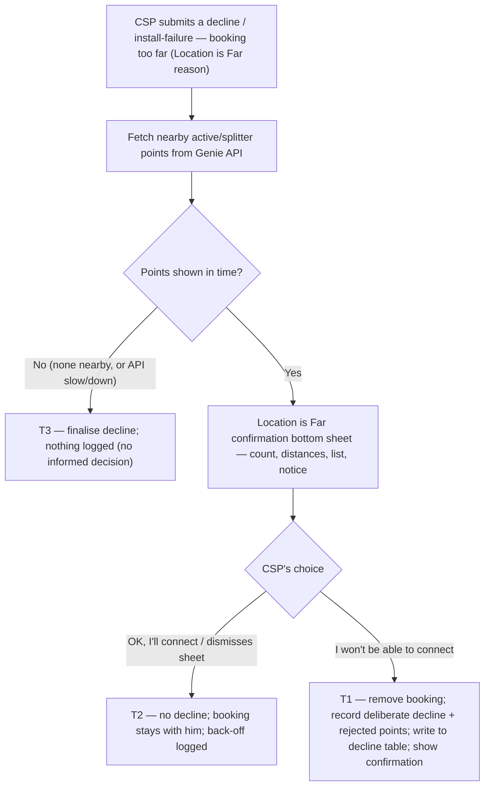

# Decline due to Location is Far — CSP Assist, Capture &amp; Log the Decline

| | | | |
|---|---|---|---|
| **Owner** — Ashish Raj (PM) | **Reviewer** — Saurabh Goyal | **Status** — Signed off | **Sign-off** — Signed off · v1.3 · 14 Aug 2026 |
| **Version** — v1.3 · 14 Aug 2026 | **Consulted — Genie (serviceability)** — Maanas | | |

> **v1.3 · 14 Aug 2026.** §7 hardened after an AC-quality pass — every AC made **atomic and observable** (20 → 27), each *Then* a single checkable domain fact. Three canon points were settled in the process: the **non-blocker confirmation bottom sheet's dismiss path** is now defined as a reconsider (R2d · T2 · AC-BACK-3); the **post-acceptance install-failure** outcome is stated as *hand the task back for re-routing* (R3a), removing the earlier "task stays accepted / not removed" wording; and **boundary + duplicate** coverage was added (1 nearby point shown; double-tap reconsider). Scope is unchanged.
>
> **v1.2 · 14 Aug 2026.** The CSP world **no longer sends a signal to Genie** — every Location is Far decline / install-failure is **logged, with all its details, to a pre-existing table (the decline table) from which Genie reads.** This feature ends at that write; Genie's read and consumption are out of scope.

---

## 1. Objective &amp; Definition of Success

**Objective.** Turn a CSP's "this booking is too far from me" decline into a clean, point-level **record the routing system can act on** — so Wiom sends each booking to the **most relevant CSP first**, and the CSP stops being handed far, irrelevant jobs. When a CSP declines a booking as too far, the app shows him the connections and splitter points he already runs nearby; this exists to make his answer **deliberate and accurate** — not to talk him out of declining — so a reflex tap on a job he could actually serve doesn't pollute the loop. When he confirms, we capture the exact points he is rejecting and **log them to the decline table**. **The win is mutual:** the CSP is no longer surfaced for bookings he genuinely can't serve, and Wiom routes to a nearer CSP instead. This feature owns the **capture and the write to the decline table**; Genie **reads the decline table** and acts, and DAS is affected only indirectly — it routes on what Genie does next.

**What success is — and isn't.** Success is a **trustworthy feedback loop into routing**, not a lower decline rate and not making CSPs reconsider. A confirmed "too far" decline is a *good* outcome — it is correct information the routing system needs. The confirmation bottom sheet's only job is to keep that information accurate.

**Boundary.** This spec governs the **CSP-side experience** for the Location is Far reason — the CSP says **the booking is too far from him** (the location is not serviceable / too far) — at both capture points — a **decline** (before acceptance) and an **install-failure report** (any time after acceptance). It covers: fetching the CSP's nearby active/splitter points from **Genie's API** and showing them in a **confirmation bottom sheet**; the back-off vs confirm outcomes; capturing the deliberate decline and the points he was shown and rejected; and **logging the decline, with its rejected points, to the decline table** (a pre-existing table from which Genie reads). Out of scope: **Genie's nearby-points API and its definition of "nearby"** (a separate Genie PRD); the **unit**, the **threshold**, and the **consequence** — de-listing the point / the candidate-list distance calc — all owned by **Genie**; **DAS** routing; **ops-calling verification** (a later phase — V1 relies on accumulation, which Genie owns); and the reason picker itself (the signed-off Reason Set PRD, Part 1). Only points **shown** to the CSP can appear in the logged record (G1).

**What Genie does with the logged decline is out of scope** — the unit, threshold, de-listing and any re-routing are all Genie's. This feature **ends at the write to the decline table**: the decline, with its details, is written to a **pre-existing table (the decline table)**, and **Genie reads from that table** (R3c). The feature makes no call to Genie.

### Guardrails — promises that hold on every path

| ID | Guardrail | One line | Anchors |
|---|---|---|---|
| G1 | **Only shown points are logged** | The decline logged on a decline / install-failure carries only the points the CSP was shown — never a point he was not shown. | R3c · AC-CONF-2 · MQ-2 |
| G2 | **Never block the decline** | If the nearby points can't be shown — none exist, or Genie's API is slow or down — the CSP can still complete his decline; he is never trapped. | R4 · AC-FAIL-1 · MQ-3 |
| G3 | **Back-off = no decline, no decline row** | If the CSP reconsiders **or dismisses the sheet**, no decline is recorded and no row is written to the decline table, and the booking stays with him. The back-off event itself is captured for measurement (MQ-1) — only the decline is absent, because no decline happened. | R2 · AC-BACK-1a · AC-BACK-1b · AC-BACK-3 · MQ-1 |
| G4 | **Capture-and-log only** | This feature captures the decline and logs it; the decline itself routes as normal (DAS / CLOS as today). Genie later reads the decline table and decides the unit, threshold and consequence. This feature commands nothing. | R3 · AC-GRD-1 · MQ-2 |
| G5 | **Logged only for this reason** | The rejected-points record is logged **only** for the Location is Far reason (booking too far) — never for any other decline / install-failure reason. | R3 · AC-REG-1 · MQ-2 |

### Success metrics

| ID | Metric | Baseline | Target | Source |
|---|---|---|---|---|
| M1 | **Feedback-loop integrity** — of deliberate Location is Far declines, the share that log a valid point-level record (CSP + capture point + only the points shown as rejected) | n/a — new capability | 100% | MQ-2 |
| M2 | **First-CSP Location is Far decline rate ↓ (loop-level, Genie-driven)** — the CSP a booking is **first routed to** declines it for the Location is Far reason less often, because Genie stops routing far bookings to CSPs who have said they can't serve there — so bookings need fewer re-routes to be accepted | measured at launch — current first-CSP Location is Far decline rate (loop-level) | Down and trending | MQ-4 |
| M3 | **Location is Far decline share ↓ (loop-level, Genie-driven)** — the share of bookings declined for the Location is Far reason falls, as far / irrelevant bookings stop being routed to a CSP who can't serve them | measured at launch — current Location is Far decline share (loop-level) | Down and trending | MQ-5 |
| M4 | **Prevented mis-routes (loop-level, Genie-driven)** — future bookings near a rejected point for which this CSP is **no longer surfaced** in Genie's candidate list, so **no task is created** for him — jobs that, before his logged decline, would have been routed to him | n/a — new capability | Grows as Genie acts on the logged declines — each one is an irrelevant task the CSP is spared and a routing attempt Wiom saves | MQ-6 |

**This feature's own success is M1 — the loop is clean and complete.** M2–M4 are the loop's downstream payoff and are driven by **Genie reading the log and acting**, not by this feature alone; they are tracked at the loop level, not owned here. Their integrity rests on the logged record being accurate — the confirmation bottom sheet and G1 keep it so.

**Diagnostic (not a target).** The back-off / reconsideration rate is watched (MQ-1) purely as a **data-quality check** — it tells us the confirmation bottom sheet is filtering out reflex declines so the loop isn't polluted. It is **not** a success metric: the aim is an accurate record, not fewer declines or more reconsiders.

**Invariant (not a metric):** G1 point-not-shown-logged = 0, zero tolerance. Monitored via MQ-2, not trended.

---

## 2. User Stories &amp; Rules

| ID | Story | MUST | MUST NOT |
|---|---|---|---|
| R1 | As a CSP about to decline a booking because it's too far from me, I first see the connections I already run nearby, so I don't refuse a job I can serve. | **(a)** When he **submits** a decline / install-failure with the Location is Far reason, fetch his nearby active/splitter points from **Genie's API** and show a **confirmation bottom sheet** — the count of nearby connections, the closest distance, the list, and a plain notice that we will stop sending him bookings here — before the decline is finalised. **(b)** Offer two explicit actions — **"I won't be able to connect"** (confirm) or **"OK, I'll connect"** (reconsider). | Finalise the Location is Far decline without the confirmation bottom sheet when nearby points exist and can be shown. |
| R2 | As a CSP who reconsiders, tapping "OK, I'll connect" returns me to the job with nothing held against me. | **(a)** On reconsider, submit no decline and keep the booking with the CSP. **(b)** Write no row to the decline table — no decline is recorded. **(c)** Record the back-off event — the confirmation bottom sheet was shown and he reconsidered — for measurement (MQ-1). **(d)** Treat a **dismissal** of the confirmation bottom sheet (closing it without choosing either action) as a reconsider — the same outcome as (a)–(c). | Record a decline, or write a decline row, on a reconsider. |
| R3 | As Wiom, when the CSP confirms "I won't be able to connect", I remove the booking, capture the deliberate decline and the points he rejected, and log them to the decline table. | **(a)** Record the Location is Far decline / install-failure as **deliberate** — made despite seeing the points — and show a confirmation with his reason (S4). The booking outcome follows the capture point: a **decline** (pre-acceptance) removes the booking; an **install-failure** (post-acceptance) records the failure and hands the task back for re-routing. **(b)** Capture the exact points he was shown (from Genie's API), **in the order they were shown**, as the points he is rejecting. **(c)** **Log** the decline to the **decline table** carrying: the **connection id and customer id** (the booking), the **CSP**, whether it was a **decline or an install-failure**, the **Location is Far reason** (booking too far), and the **points he was shown, in order**, as the points he rejected. | Log any point that was not shown to him (G1); log the rejected-points record for any reason other than Location is Far (G5). |
| R4 | As a CSP, I can always complete my decline even when the nearby points can't be shown. | **(a)** If Genie returns no nearby points, or its API does not respond in time, let the Location is Far decline proceed without the confirmation bottom sheet — record it, but **log no rejected-points record**: the CSP was shown nothing, so he made no informed decision and there is nothing to log. **(b)** Tell the CSP the check was skipped, not that it failed. | Block, trap, or spin the CSP because the confirmation bottom sheet could not load (G2); or log a rejected-points record from a decline where no points were shown. |
| R5 | As Wiom, I want the same assist and capture at both moments a Location is Far reason is given, so the logged record is complete. | Run the identical assist + capture at a **decline** (pre-acceptance) and an **install-failure report** (after acceptance). | Let the two paths capture differently, or skip the assist at one of them. |

---

## 3. System Behaviour

### 3a. System flow chart

**Precedence:** if Genie's points arrive **after** the app has already proceeded without the confirmation bottom sheet (T3), that stands — the decline is already recorded; the late points are ignored (AC-RACE-1).

### 3b. State transition table — canon

Lifecycle of a **Location is Far decline assist** (created when a CSP selects the Location is Far reason at a decline or an install-failure). The reason picker itself (Part 1) and Genie's consumption of the logged decline (unit, threshold, consequence) are out of scope; this spec governs only the CSP-side assist, capture and log.

| ID | From | Action / Trigger | Rule / Check | To | Side-effects |
|---|---|---|---|---|---|
| T1 | Confirmation bottom sheet shown | CSP taps "I won't be able to connect" | Points were shown | Recorded &amp; logged | Booking removed from him with a confirmation ("booking removed" + his reason, S4); Location is Far decline / install-failure recorded as **deliberate** (R3a); rejected points = the points shown (R3b); decline written to the decline table — CSP, capture point, rejected points (R3c, G1, G4). |
| T2 | Confirmation bottom sheet shown | CSP taps "OK, I'll connect" **or dismisses the sheet without choosing** | — | Reconsidered | No decline recorded; no row written to the decline table; booking stays with the CSP; the back-off is logged for measurement (R2, G3, MQ-1). |
| T3 | — | CSP submits the Location is Far reason | No points shown in time (none nearby, or API slow/down) | Recorded, **not** logged | Location is Far decline / install-failure finalised and recorded; **no rejected-points record logged** — the CSP was shown no points, so there is no informed decision to log; CSP told the check was skipped (R4, G2). |

---

## 4. Screen Requirements

**Experience intent:** the app is on the CSP's side — *"before you turn this down, here's what you already run nearby"* — and honest about what happens next (*"we'll stop sending you bookings here so your time isn't wasted"*). Never nagged, never blocked.

**Master design file:** Figma · "PA — Dev → January 2026 Onwards" (CSP app) — [design & assets](https://figma.com/design/W2Z3B5xfFO3UibJSzkyHn2/PA---Dev-->-January-2026-Onwards?t=sU3hI2FvbPQONDUO-0) · [interactive prototype](https://www.figma.com/proto/W2Z3B5xfFO3UibJSzkyHn2/PA---Dev--%3E-January-2026-Onwards?node-id=10827-2818&viewport=382%2C-6863%2C0.44&t=mwwU62RAMEkIo0IQ-1&scaling=min-zoom&content-scaling=fixed&starting-point-node-id=10827%3A2818&show-proto-sidebar=1&page-id=9780%3A1268). Frames **S2** (reason sheet, Part 1), **S1** (Location is Far confirmation bottom sheet), **S4** (confirmation).

> ⚑ **Exact copy comes from Figma.** All strings (titles, the distance phrasing, the notice, button labels — English and Hindi) are the Figma file's; the copy quoted here is indicative.

### Location is Far confirmation bottom sheet (S1) — CSP app — decline &amp; install-failure

**States:** loading (fetching points, brief wait) · showing (his nearby connections + notice + two actions) · skipped (no points / API not in time — decline finalised, R4 / T3)
**Freshness:** the points and distances reflect Genie's API response for this booking at the moment of submit.
**Two actions:** the confirmation bottom sheet offers the CSP two actions — **"I won't be able to connect"** (confirm) or **"OK, I'll connect"** (reconsider) (R1b). Being a non-blocker popup, **dismissing it without choosing is treated as a reconsider** (T2, R2d).

| Element | Source / Routes to | Logic |
|---|---|---|
| Field — title | Genie API (count + closest distance) | e.g. "You already have N connections near this place — only D away"; N and D from Genie |
| Field — connections list | Genie API (his own active connections / splitter near the booking) | each row = name · address · distance, **or** a single "your splitter" row; the list scrolls when it is longer than the sheet fits |
| Field — notice | — | plain transparency line: the booking is too far to serve → we'll stop sending him bookings here so his time isn't wasted |
| Action — "I won't be able to connect" | T1 via §3a | confirms the decline; removes the booking; records the deliberate decline + the shown points as rejected; logs to the decline table (R3) → S4 |
| Action — "OK, I'll connect" | T2 via §3a | reconsiders; no decline; booking stays with him (R2) |

### Confirmation (S4) — CSP app

**States:** shown (after T1)
**Freshness:** on confirm.

| Element | Source / Routes to | Logic |
|---|---|---|
| Field — outcome + reason | reason-capture (R3a) | confirms the outcome and shows his reason (the booking was too far to serve); copy is capture-point-specific — "booking removed" on a decline, failure recorded on an install-failure |
| Action — OK | — | dismisses to the feed |

**Skipped (no confirmation bottom sheet).** When Genie returns no nearby points or its API is not in time, the confirmation bottom sheet (S1) is not shown; the decline is finalised (T3) with **nothing logged** (no informed decision), and the CSP sees a neutral "we couldn't check nearby connections" note — never an error that blocks (R4b, G2).

---

## 5. Configurability

**None.** This feature has no PM-configurable parameters. The app waits briefly for Genie's points and, if they do not arrive, proceeds without the confirmation bottom sheet — never blocking the CSP (R4, G2). That wait is a fixed implementation timeout owned by Eng, not a business config.

---

## 6. Measurement

| ID | The system must be able to answer… | Feeds |
|---|---|---|
| MQ-1 | Of Location is Far declines where the confirmation bottom sheet was shown, what share backed off ("OK, I'll connect")? — data-quality diagnostic, not a target | diagnostic · G3 |
| MQ-2 | For every logged rejected-points record, was it for the Location is Far reason only (never another reason) and carrying only the points that were shown? | M1 · G1 · G4 · G5 invariant |
| MQ-3 | Of Location is Far declines, how many saw the confirmation bottom sheet vs proceeded without it (no points / API not in time)? | R4 · G2 |
| MQ-4 | Over time, does the first-routed CSP decline for the Location is Far reason less often — the first routing attempt accepted more, needing fewer re-routes? (loop outcome, driven by Genie) | M2 |
| MQ-5 | Over time, does the Location is Far decline share fall as far / irrelevant bookings stop being routed to a CSP who can't serve them? (loop outcome, driven by Genie) | M3 |
| MQ-6 | Per CSP × rejected point, how many future bookings did Genie exclude him from the candidate list for — because of his logged Location is Far decline — that it would have surfaced him for before, i.e. tasks never created for him? (loop outcome, driven by Genie) | M4 |
| MQ-7 | Per task, how many bookings timed out with **no action from the CSP** — the **P41 / P74** timeouts — so passive timeouts are told apart from deliberate Location is Far declines? | diagnostic (M2 / M3 interpretation) |
| MQ-8 | Is every screen shown and every CTA tapped across the flow — the Location is Far confirmation bottom sheet (S1), the confirmation (S4), and the two actions ("I won't be able to connect" / "OK, I'll connect") — captured as an event (**preferably in CleverTap**), so the full funnel (confirmation bottom sheet shown → confirm / reconsider / skipped) can be analysed? | MQ-1 · MQ-3 · G3 · R2c |

---

## 7. Acceptance Criteria

**Shared precondition (CONF &amp; BACK groups).** A CSP with a booking in the **pre-acceptance state**; Genie returns **3** nearby active/splitter points for it; he has selected the "Location is Far" reason *(the reason value is owned by the Reason Set PRD, Part 1)*; the confirmation bottom sheet (S1) is showing those 3 points.

### SHOW — Confirmation bottom sheet (R1)

| AC | Given / When / Then | Verifies | Status |
|---|---|---|---|
| AC-SHOW-1a | **Given** a CSP declines with the Location is Far reason and Genie returns **3** nearby points, **When** the decline is made, **Then** a **confirmation bottom sheet** is shown **before the decline is finalised**, offering exactly the two actions **"I won't be able to connect"** and **"OK, I'll connect"**. | R1a · R1b | Settled |
| AC-SHOW-1b | **Given** the confirmation bottom sheet is shown for **3** points, **When** it renders, **Then** it displays the **count = 3**, the **list of all 3 points**, the **closest-point distance** (unit and rounding per the Figma copy), and the **notice** that Wiom will stop sending him bookings there. | R1a | Settled |
| AC-SHOW-1c | **Given** Genie returns **1** nearby point (the minimum), **When** the decline is made, **Then** the **confirmation bottom sheet is shown with that 1 point** — the sheet is shown for any 1–4 points Genie returns (the cap is Genie's). | R1a | Settled |

### CONF — Confirmed "I won't be able to connect" (T1)

| AC | Given / When / Then | Verifies | Status |
|---|---|---|---|
| AC-CONF-1a | **When** the CSP **declines** with "I won't be able to connect", **Then** a decline for this (booking, CSP) is **registered carrying the 3 points he was shown, in the order shown**, as the points he rejects. | R1b · R3a · R3b · T1 | Settled |
| AC-CONF-1b | **When** the CSP declines with "I won't be able to connect", **Then** the **booking is removed from his feed**. | R3a · T1 | Settled |
| AC-CONF-1c | **When** the CSP declines with "I won't be able to connect", **Then** he is shown the **confirmation (S4)** stating his Location is Far reason. | R3a · T1 | Settled |
| AC-CONF-1d | **When** the CSP declines with "I won't be able to connect", **Then** a **row is written to the decline table** for this booking carrying the **connection id, customer id, CSP, capture point = decline, the reason, and the 3 points in the order shown** — verifiable in the decline table. | R3c · T1 · G4 | Settled |
| AC-CONF-2 | **Given** the confirmation bottom sheet showed **3** points while Genie's nearby-points response contained **5**, **When** the CSP declines with "I won't be able to connect", **Then** the **written row** carries **exactly those 3 shown points and none of the 2** that were not shown. | R3c · G1 · T1 | Settled |

### BACK — Reconsidered or dismissed (T2)

| AC | Given / When / Then | Verifies | Status |
|---|---|---|---|
| AC-BACK-1a | **When** the CSP taps "OK, I'll connect", **Then** **no decline or install-failure is recorded** — the booking **remains assigned to him and remains acceptable**, unchanged from before the sheet was shown. | R1b · R2a · T2 · G3 | Settled |
| AC-BACK-1b | **When** the CSP taps "OK, I'll connect", **Then** **no row is written to the decline table** for this booking. | R2b · T2 · G3 | Settled |
| AC-BACK-1c | **When** the CSP taps "OK, I'll connect", **Then** **exactly one back-off event** is logged for this booking, **correlated by booking id** to the moment the confirmation bottom sheet was shown, carrying the **count of points shown (3)**. | R2c · T2 · MQ-1 | Settled |
| AC-BACK-2a | **Given** the **install-failure** capture point, **When** the CSP taps "OK, I'll connect", **Then** **no install-failure is reported** — the **task remains assigned to him**, unchanged. | R2 · R5 · T2 | Settled |
| AC-BACK-2b | **Given** the same, **When** the CSP taps "OK, I'll connect", **Then** **exactly one back-off event** is logged for this booking (per AC-BACK-1c). | R2c · R5 · MQ-1 | Settled |
| AC-BACK-3 | **Given** the confirmation bottom sheet is shown, **When** the CSP **dismisses it without choosing** either action, **Then** it is **treated as a reconsider (T2)** — the booking stays assigned to him, **no decline is recorded or written to the decline table**, and **exactly one back-off event** is logged. | R2d · T2 · G3 · MQ-1 | Settled |

### STR — Proceeded without the assist (T3)

| AC | Given / When / Then | Verifies | Status |
|---|---|---|---|
| AC-STR-1 | **Given** a CSP declines with the Location is Far reason and Genie returns **zero nearby points (none exist)**, **When** the decline is made, **Then** the decline is **registered** and **no row is written to the decline table** (no points were shown, so no informed decision). | R4a · T3 · G2 | Settled |
| AC-STR-2 | **Given** the same, **When** the decline is made, **Then** the CSP is shown a note that the **nearby-connections check was skipped (not an error)** and the decline **completes without being blocked**. | R4b · T3 · G2 | Settled |

### WF — Workflows (both capture points)

| AC | Given / When / Then | Verifies | Status |
|---|---|---|---|
| AC-WF-1a | **Given** identical Genie points at both capture points, **When** one CSP confirms "I won't be able to connect" on a **decline** and another on an **install-failure**, **Then** both **written rows carry the same points, in the same order**, as rejected. | R5 · T1 · G4 | Settled |
| AC-WF-1b | **Given** the same, **Then** the decline's row has **capture point = decline** and the install-failure's row has **capture point = install-failure**. | R5 · R3c | Settled |
| AC-WF-2a | **Given** a post-acceptance **install-failure**, **When** the CSP confirms "I won't be able to connect", **Then** the **install-failure is registered as deliberate** and he is shown the **confirmation (S4)**. | R3a · R5 · T1 | Settled |
| AC-WF-2b | **Given** the same, **When** he confirms, **Then** the **task is handed back for re-routing** — it re-enters routing, available for re-assignment (R3a). | R3a · R5 · T1 | Settled |
| AC-WF-2c | **Given** the same, **When** he confirms, **Then** the **written row's capture point = install-failure**. | R3c · R5 · T1 | Settled |

### GRD — Guardrails

| AC | Given / When / Then | Verifies | Status |
|---|---|---|---|
| AC-GRD-1 | **Given** a CSP confirms "I won't be able to connect", **When** the decline is made, **Then** this feature's **only new outbound effect is the single write to the decline table** — it makes **no call to Genie and takes no de-listing / coverage action**. (The decline itself routes as normal — DAS / CLOS as today, per G4.) | G4 · R3 | Settled |

### FAIL — Failure window (Genie API no response)

| AC | Given / When / Then | Verifies | Status |
|---|---|---|---|
| AC-FAIL-1 | **Given** a CSP declines with the Location is Far reason and Genie's API does not respond within the Eng-owned fetch timeout, **When** the decline is made, **Then** the decline **completes without the confirmation bottom sheet**, the CSP is **not blocked and the decline is not held pending the response**, and **no row is written to the decline table**. | R4a · G2 · T3 | Settled |

### REG — Regression (no downstream command)

| AC | Given / When / Then | Verifies | Status |
|---|---|---|---|
| AC-REG-1 | **Given** a CSP declines for any reason **other than Location is Far**, **When** the decline is made, **Then** **no confirmation bottom sheet appears, no nearby-points fetch is made, and no row is written to the decline table** — the Part 1 reason-capture is the only behaviour. | §1 Boundary · G5 | Settled |

### RACE — Races

| AC | Given / When / Then | Verifies | Status |
|---|---|---|---|
| AC-RACE-1 | **Given** the flow already proceeded without the confirmation bottom sheet and the decline is registered (T3), **When** Genie's points arrive later, **Then** they are **ignored** — no confirmation bottom sheet appears and the registered decline is **unchanged**. | §3a precedence | Settled |

### DUP — Duplicate trigger

| AC | Given / When / Then | Verifies | Status |
|---|---|---|---|
| AC-DUP-1 | **Given** the confirmation bottom sheet is shown with points, **When** the CSP **double-taps** "I won't be able to connect", **Then** **exactly one** decline is registered and **one** row is written to the decline table for that booking, and the second tap adds nothing (the confirmation S4 is shown once). | T1 | Settled |
| AC-DUP-2 | **Given** the confirmation bottom sheet is shown with points, **When** the CSP **double-taps** "OK, I'll connect", **Then** **exactly one** back-off event is logged for that booking and the booking stays assigned to him (the second tap adds nothing). | T2 · MQ-1 | Settled |

---

## 8. Glossary

| Term | Meaning | Owner (domain) |
|---|---|---|
| Location is Far decline | **Canonical definition:** a decline (or install-failure) where the CSP gives the Location is Far reason — he says the booking is too far from him / the location is not serviceable. This spec's trigger. (The exact display copy lives in Figma, Part 1.) | — |
| Nearby active/splitter points | The CSP's own active connections and splitter points near the booking, **served by Genie's API**; shown in the assist so he can see what he already reaches. This feature reads them; it does not define "nearby". | Genie (serviceability) |
| Deliberate decline | A Location is Far decline the CSP confirmed **after** seeing his nearby connections — worth far more than a reflex tap; the only kind that logs rejected points (T1). | — |
| Rejected points | The nearby points the CSP was shown and still declined over — the payload this feature logs to the decline table. Never contains a point he was not shown (G1). | — |
| Decline table | **Canonical definition:** the pre-existing table where declines and install-failures are recorded and **from which Genie reads.** When a CSP confirms a Location is Far decline after seeing his nearby points, this feature writes the decline there with all its details — connection id + customer id, the CSP, decline vs install-failure, the Location is Far reason, and the rejected points, in order. Written only for this reason (G5); never carries a point not shown (G1). This feature ends at the write; Genie's read is its own. | — |
| Back-off | The CSP tapping "OK, I'll connect" at the confirmation bottom sheet — he reconsiders and keeps the job; no decline is recorded and nothing is logged, but the back-off event itself is logged for measurement (T2, G3, MQ-1). | — |
| Wait for Genie | **Canonical definition:** the brief wait for Genie's points before the app proceeds without the confirmation bottom sheet so the CSP is never blocked (R4, G2); a fixed implementation timeout, not a business config. | Eng |

---

## 9. Notes for System Capabilities

What the platform must be able to do for this feature to exist. Whether these are one system or several, and how they interact, is the implementer's design.

| Capability | Needed by |
|---|---|
| At Location is Far decline time, fetch the CSP's nearby active/splitter points from Genie's API, within a brief wait. | R1a |
| Show a confirmation bottom sheet with those points and two choices — reconsider, or confirm not serviceable. | R1 · T1 · T2 |
| Capture the deliberate decline and the exact points shown as rejected — never a point not shown. | R3 · G1 |
| Write the decline to the pre-existing **decline table** — connection + customer id, CSP, decline vs install-failure, the Location is Far reason, and the ordered points shown as rejected — for the Location is Far reason only, taking no routing or de-listing action itself; Genie reads from that table. | R3c · G4 · G5 |
| Write the decline durably — a confirmed deliberate decline must not silently fail to be logged. | R3c · M1 |
| Let the CSP complete his decline when the points can't be shown (none, or API not in time), never blocking him — recording the decline but logging no rejected-points record. | R4 · G2 |
| Run the identical assist and capture at both a decline and an install-failure report. | R5 |

---

## Overrides

| Rule overridden | What was done instead | Rationale | Approved by |
|---|---|---|---|
| What/why-only — no mechanism (J3 envelope purity) | The PRD names the system-of-record: the decline is **written to a pre-existing table (the decline table)** that Genie reads, rather than pushed to Genie (§1 Boundary, R3c, §9) | PM's call — the decline table is the existing system-of-record and Genie already reads it, so the feature ends at the write to the decline table and introduces no new transport to Genie | Ashish Raj (PM) |
