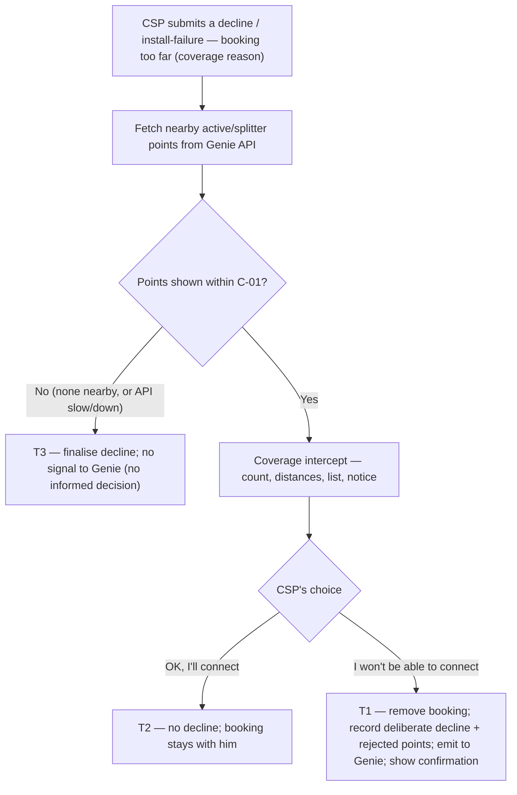

# Coverage Decline Loop — CSP Assist &amp; Capture — the "booking too far" reason

| | | | |
|---|---|---|---|
| **Owner** — Ashish Raj (PM) | **Reviewer** — TBD ⚠️ *AI GENERATED — review* | **Status** — Draft | **Sign-off** — Pending |
| **Version** — v0.1 · 11 Aug 2026 | **Consulted — Genie (serviceability)** — TBD ⚠️ *AI GENERATED — review* | | |

---

## 1. Objective &amp; Definition of Success

**Objective.** Turn a CSP's "this booking is too far from me" decline into a clean, point-level **feedback signal that routing (Genie / DAS) can act on** — so Wiom sends each booking to the **most relevant CSP first**, and the CSP stops being handed far, irrelevant jobs. When a CSP declines a booking as too far, the app shows him the connections he already runs nearby; this exists to make his answer **deliberate and accurate** — not to talk him out of declining — so a reflex tap on a job he could actually serve doesn't pollute the loop. When he confirms, we capture the exact points he is rejecting and emit them to Genie. **The win is mutual:** the CSP is no longer surfaced for bookings he genuinely can't serve, and Wiom routes to a nearer CSP instead. This feature owns the **capture and emit**; Genie and DAS act on the signal.

**What success is — and isn't.** Success is a **trustworthy feedback loop into routing**, not a lower decline rate and not making CSPs reconsider. A confirmed "too far" decline is a *good* outcome — it is correct information the routing system needs. The intercept's only job is to keep that information accurate.

**Boundary.** This spec governs the **CSP-side experience** for the coverage reason — the CSP says **the booking is too far from him** (the location is not serviceable / too far) — at both capture points — a **decline** (before acceptance) and an **install-failure report** (any time after acceptance). It covers: fetching the CSP's nearby active/splitter points from **Genie's API** and showing them in a **blocking confirm**; the back-off vs confirm outcomes; capturing the deliberate decline and the points he was shown and rejected; and **emitting that signal to Genie**. Out of scope: **Genie's nearby-points API and its definition of "nearby"** (a separate Genie PRD); the **unit**, the **threshold**, and the **consequence** — de-listing the point / the candidate-list distance calc — all owned by **Genie**; **DAS** routing; **ops-calling verification** (a later phase — V1 relies on accumulation, which Genie owns); and the reason picker itself (the signed-off Reason Set PRD, Part 1). Only points **shown** to the CSP can appear in the emitted signal (G1).

**What Genie does on receiving the signal is out of scope** — the unit, threshold, de-listing and any re-routing are all Genie's. The signal is **pushed** to Genie as an explicit, self-describing event, **not** written to a table for Genie to poll; an explicit push is the cleaner contract (R3c).

### Guardrails — promises that hold on every path

| ID | Guardrail | One line | Anchors |
|---|---|---|---|
| G1 | **Only shown points are sent to Genie** | The signal sent to Genie on a decline / install-failure carries only the points the CSP was shown — never a point he was not shown. | R3c · AC-CONF-2 · MQ-2 |
| G2 | **Never block the decline** | If the nearby points can't be shown — none exist, or Genie's API is slow or down — the CSP can still complete his decline; he is never trapped. | R4 · AC-FAIL-1 · MQ-3 |
| G3 | **Back-off leaves no trace** | If the CSP reconsiders, nothing is recorded and nothing is emitted, and the booking stays with him. | R2 · AC-BACK-1 · MQ-1 |
| G4 | **Capture-only** | This feature captures and emits a signal; Genie decides the unit, threshold and consequence, and DAS routes. It commands nothing. | R3 · AC-GRD-1 · MQ-2 |
| G5 | **Emitted only for this reason** | A signal is pushed to Genie **only** for the coverage reason (booking too far) — never for any other decline / install-failure reason. | R3 · AC-REG-1 |

### Success metrics

| ID | Metric | Baseline | Target | Source |
|---|---|---|---|---|
| M1 | **Feedback-loop integrity** — of deliberate coverage declines, the share that emit a valid point-level signal to Genie (CSP + capture point + only the points shown as rejected) | n/a — new capability | 100% | MQ-2 |
| M2 | **First-CSP coverage-decline rate ↓ (loop-level, Genie-driven)** — the CSP a booking is **first routed to** declines it for the far-distance reason less often, because Genie stops routing far bookings to CSPs who have said they can't serve there — so bookings need fewer re-routes to be accepted | current first-CSP coverage-decline rate — to fill ⚠️ *AI GENERATED — review* | Down and trending | MQ-4 |
| M3 | **Coverage-decline share ↓ (loop-level, Genie-driven)** — the share of bookings declined for the far-distance reason falls, as far / irrelevant bookings stop being routed to a CSP who can't serve them | current coverage-decline share — to fill ⚠️ *AI GENERATED — review* | Down and trending | MQ-5 |
| M4 | **Prevented mis-routes (loop-level, Genie-driven)** — future bookings near a rejected point for which this CSP is **no longer surfaced** in Genie's candidate list, so **no task is created** for him — jobs that, before his signal, would have been routed to him | n/a — new capability | Grows as Genie acts on the signals — each one is an irrelevant task the CSP is spared and a routing attempt Wiom saves ⚠️ *AI GENERATED — review* | MQ-6 |

**This feature's own success is M1 — the loop is clean and complete.** M2–M4 are the loop's downstream payoff and are driven by **Genie acting on the signal**, not by this feature alone; they are tracked at the loop level, not owned here. Their integrity rests on the signal being accurate — the intercept and G1 keep it so.

**Diagnostic (not a target).** The back-off / reconsideration rate is watched (MQ-1) purely as a **signal-quality check** — it tells us the intercept is filtering out reflex declines so the loop isn't polluted. It is **not** a success metric: the aim is an accurate signal, not fewer declines or more reconsiders.

**Invariant (not a metric):** G1 point-not-shown-sent-to-Genie = 0, zero tolerance. Monitored via MQ-2, not trended.

---

## 2. User Stories &amp; Rules

| ID | Story | MUST | MUST NOT |
|---|---|---|---|
| R1 | As a CSP about to decline a booking because it's too far from me, I first see the connections I already run nearby, so I don't refuse a job I can serve. | **(a)** When he **submits** a decline / install-failure with the coverage reason, fetch his nearby active/splitter points from **Genie's API** and show a **blocking confirm** (the "coverage intercept") — the count of nearby connections, the closest distance, the list, and a plain notice that we will stop sending him bookings here — before the decline is finalised (within C-01). **(b)** Require an explicit choice — **"I won't be able to connect"** (confirm) or **"OK, I'll connect"** (reconsider). | Finalise the coverage decline without the intercept when nearby points exist and can be shown. |
| R2 | As a CSP who reconsiders, tapping "OK, I'll connect" returns me to the job with nothing held against me. | **(a)** On reconsider, submit no decline and keep the booking with the CSP. **(b)** Emit nothing to Genie. | Record a decline or send any signal to Genie on a reconsider. |
| R3 | As Wiom, when the CSP confirms "I won't be able to connect", I remove the booking, capture the deliberate decline and the points he rejected, and send them to Genie. | **(a)** Record the coverage decline / install-failure as **deliberate** — made despite seeing the points — and show a confirmation with his reason (S4). The booking outcome follows the capture point: a **decline** (pre-acceptance) removes the booking; an **install-failure** (post-acceptance) records the failure and hands the task back for re-routing. **(b)** Capture the exact points he was shown (from Genie's API), **in the order they were shown**, as the points he is rejecting. **(c)** **Push** an explicit signal to Genie carrying: the **connection id and customer id** (the booking), the **CSP**, whether it was a **decline or an install-failure**, the **coverage reason** (booking too far), and the **points he was shown, in order**, as the points he rejected. | Send Genie any point that was not shown to him (G1); push a signal for any non-coverage reason (G5); or leave the signal in a database for Genie to poll instead of pushing it. |
| R4 | As a CSP, I can always complete my decline even when the nearby points can't be shown. | **(a)** If Genie returns no nearby points, or its API does not respond within C-01, let the coverage decline proceed without the intercept — record it, but **send no signal to Genie**: the CSP was shown nothing, so he made no informed decision and there is nothing to report. **(b)** Tell the CSP the check was skipped, not that it failed. ⚠️ *AI GENERATED — review* | Block, trap, or spin the CSP because the intercept could not load (G2); or send Genie a signal from a decline where no points were shown. |
| R5 | As Wiom, I want the same assist and capture at both moments a coverage reason is given, so the signal is complete. | Run the identical assist + capture at a **decline** (pre-acceptance) and an **install-failure report** (after acceptance). | Let the two paths capture differently, or skip the assist at one of them. |

---

## 3. System Behaviour

### 3a. System flow chart

**Precedence:** if Genie's points arrive **after** the C-01 fallback already fired (T3), the fallback stands — the decline is already recorded; the late points are ignored (AC-RACE-1).

### 3b. State transition table — canon

Lifecycle of a **coverage-decline assist** (created when a CSP selects the coverage reason at a decline or an install-failure). The reason picker itself (Part 1) and Genie's consumption of the signal (unit, threshold, consequence) are out of scope; this spec governs only the CSP-side assist, capture and emit.

| ID | From | Action / Trigger | Rule / Check | To | Side-effects |
|---|---|---|---|---|---|
| T1 | Intercept shown | CSP taps "I won't be able to connect" | Points were shown | Recorded &amp; emitted | Booking removed from him with a confirmation ("booking removed" + his reason, S4); coverage decline / install-failure recorded as **deliberate** (R3a); rejected points = the points shown (R3b); signal emitted to Genie — CSP, capture point, rejected points (R3c, G1, G4). |
| T2 | Intercept shown | CSP taps "OK, I'll connect" | — | (no record) | No decline recorded; nothing emitted; booking stays with the CSP (R2, G3). |
| T3 | — | CSP submits the coverage reason | No points shown within C-01 (none nearby, or API slow/down) | Recorded, **not** sent | Coverage decline / install-failure finalised and recorded; **no signal sent to Genie** — the CSP was shown no points, so there is no informed decision to report; CSP told the check was skipped (R4, G2). |

---

## 4. Screen Requirements

**Experience intent:** the app is on the CSP's side — *"before you turn this down, here's what you already run nearby"* — and honest about what happens next (*"we'll stop sending you bookings here so your time isn't wasted"*). Never nagged, never blocked. ⚠️ *AI GENERATED — review*

**Master design file:** designed — frames **S2** (reason sheet, Part 1), **S1** (coverage intercept), **S4** (confirmation). Figma: CSP app · "PA — Dev → January 2026 Onwards" — link to confirm. ⚠️ *AI GENERATED — review*

> ⚑ **Exact copy comes from Figma.** All strings (titles, the distance phrasing, the notice, button labels — English and Hindi) are the Figma file's; the copy quoted here is indicative.

### Coverage intercept (S1) — CSP app — decline &amp; install-failure

**States:** loading (fetching points, within C-01) · showing (his nearby connections + notice + two actions) · skipped (no points / API not in time — decline finalised, R4 / T3)
**Freshness:** the points and distances reflect Genie's API response for this booking at the moment of submit.

| Element | Source / Routes to | Logic |
|---|---|---|
| Field — title | Genie API (count + closest distance) | e.g. "You already have N connections near this place — only D away"; N and D from Genie |
| Field — connections list | Genie API (his own active connections / splitter near the booking) | each row = name · address · distance, **or** a single "your splitter" row; scrollable when more than 2 (up to 5) |
| Field — notice | — | plain transparency line: the booking is too far to serve → we'll stop sending him bookings here so his time isn't wasted |
| Action — "I won't be able to connect" | T1 via §3a | confirms the decline; removes the booking; records the deliberate decline + the shown points as rejected; emits to Genie (R3) → S4 |
| Action — "OK, I'll connect" | T2 via §3a | reconsiders; no decline; booking stays with him (R2) |

### Confirmation (S4) — CSP app

**States:** shown (after T1)
**Freshness:** on confirm.

| Element | Source / Routes to | Logic |
|---|---|---|
| Field — outcome + reason | reason-capture (R3a) | confirms the outcome and shows his reason (the booking was too far to serve); copy is capture-point-specific — "booking removed" on a decline, failure recorded on an install-failure |
| Action — OK | — | dismisses to the feed |

**Skipped (no intercept).** When Genie returns no nearby points or its API is not in time (C-01), the intercept (S1) is not shown; the decline is finalised (T3) with **no signal sent to Genie** (no informed decision), and the CSP sees a neutral "we couldn't check nearby connections" note — never an error that blocks (R4b, G2). ⚠️ *AI GENERATED — review*

---

## 5. Configurability

| ID | Parameter | Default | Range | Who changes it |
|---|---|---|---|---|
| C-01 | Assist wait window — how long the app waits for Genie's points before proceeding without the assist (the CSP is never blocked, R4/G2) | 3 seconds ⚠️ *AI GENERATED — review* | 1–8 s ⚠️ *AI GENERATED — review* | Product + Eng |

---

## 6. Measurement

| ID | The system must be able to answer… | Feeds |
|---|---|---|
| MQ-1 | Of coverage declines where the intercept was shown, what share backed off ("OK, I'll connect")? — signal-quality diagnostic, not a target | diagnostic · G3 |
| MQ-2 | For every confirmed coverage decline, was a signal emitted to Genie carrying only the points that were shown? | M1 · G1 · G4 invariant |
| MQ-3 | Of coverage-reason declines, how many saw the intercept vs proceeded without it (no points / API not in time)? | R4 · G2 |
| MQ-4 | Over time, does the first-routed CSP decline for the far-distance reason less often — the first routing attempt accepted more, needing fewer re-routes? (loop outcome, driven by Genie) | M2 ⚠️ *AI GENERATED — review* |
| MQ-5 | Over time, does the coverage-decline share fall as far / irrelevant bookings stop being routed to a CSP who can't serve them? (loop outcome, driven by Genie) | M3 ⚠️ *AI GENERATED — review* |
| MQ-6 | Per CSP × rejected point, how many future bookings did Genie exclude him from the candidate list for — because of his coverage signal — that it would have surfaced him for before, i.e. tasks never created for him? (loop outcome, driven by Genie) | M4 ⚠️ *AI GENERATED — review* |

---

## 7. Acceptance Criteria

### CONF — Confirmed "I won't be able to connect" (T1)

| AC | Given / When / Then | Verifies | Status |
|---|---|---|---|
| AC-CONF-1 | **Given** a CSP declining a booking with the coverage reason (booking too far) and is shown 3 of his own active connections within Genie's range, **When** he taps "I won't be able to connect", **Then** the coverage decline is recorded as deliberate, the booking is removed and he sees a confirmation with his reason (S4), and a signal is **pushed** to Genie carrying the connection + customer id, the CSP, that it was a decline for the coverage reason, and those 3 points **in the order shown** as rejected. | R3a · R3b · R3c · T1 · G4 | Settled |
| AC-CONF-2 | **Given** the same confirm, **When** the signal is emitted, **Then** it names only the points that were shown — no point the CSP was not shown ever appears in it. | R3c · G1 · T1 | Settled |

### BACK — Reconsidered (T2)

| AC | Given / When / Then | Verifies | Status |
|---|---|---|---|
| AC-BACK-1 | **Given** a CSP shown his nearby connections on a coverage decline, **When** he taps "OK, I'll connect", **Then** no decline is recorded, nothing is emitted to Genie, and the booking stays with him. | R2a · R2b · T2 · G3 | Settled |

### STR — Proceeded without the assist (T3)

| AC | Given / When / Then | Verifies | Status |
|---|---|---|---|
| AC-STR-1 | **Given** a CSP selects the coverage reason and Genie returns no nearby points, **When** he confirms the decline, **Then** the coverage decline is recorded, **no signal is sent to Genie** (no points were shown, so no informed decision), and he is told the nearby check was skipped. | R4a · R4b · T3 · G2 | Settled ⚠️ *AI GENERATED — review* |

### WF — Workflows (both capture points)

| AC | Given / When / Then | Verifies | Status |
|---|---|---|---|
| AC-WF-1 | **Given** the same Genie points, **When** one CSP hits the coverage reason on a **decline** and another on an **install-failure report**, **Then** both see the identical blocking-confirm assist and, on "I won't be able to connect", both emit a signal to Genie with the rejected points — the only differences recorded are the capture point and the outcome copy (booking removed vs failure recorded). | R5 · T1 · G4 | Settled |

### GRD — Guardrails

| AC | Given / When / Then | Verifies | Status |
|---|---|---|---|
| AC-GRD-1 | **Given** a confirmed coverage decline with rejected points, **When** the signal reaches Genie, **Then** this feature has taken no routing or de-listing action itself — Genie decides the unit, threshold and consequence. | G4 · R3 | Settled |

### FAIL — Failure window (C-01)

| AC | Given / When / Then | Verifies | Status |
|---|---|---|---|
| AC-FAIL-1 | **Given** a CSP selects the coverage reason, **When** Genie's API has not returned points within C-01 (3 s), **Then** the app lets him complete the decline without the intercept — never blocked or left spinning — and **no signal is sent to Genie**. | R4a · G2 · C-01 · T3 | Settled |

### REG — Regression (no downstream command)

| AC | Given / When / Then | Verifies | Status |
|---|---|---|---|
| AC-REG-1 | **Given** this feature ships, **When** a CSP declines for any **non-coverage** reason, **Then** the reason-capture flow (Part 1) is unchanged — no intercept, no Genie fetch, **and no signal pushed to Genie** — and routing / DAS behave exactly as before. | §1 Boundary · G5 | Settled |

### BV — Boundary values (C-01)

| AC | Given / When / Then | Verifies | Status |
|---|---|---|---|
| AC-BV-1 | **Given** Genie's points arrive at 2.9 s (just inside C-01 of 3 s), **When** the CSP is on the coverage reason, **Then** the blocking-confirm assist is shown. | C-01 · R1a | Settled |
| AC-BV-2 | **Given** Genie's points arrive at 3.1 s (just outside C-01), **When** the CSP is on the coverage reason, **Then** the assist is skipped, the decline proceeds (T3), and no signal is sent to Genie — the late points are ignored. | C-01 · R4a · T3 | Settled |

### RACE — Races

| AC | Given / When / Then | Verifies | Status |
|---|---|---|---|
| AC-RACE-1 | **Given** the C-01 fallback already fired and the decline was recorded straight (T3), **When** Genie's points arrive afterwards, **Then** they are ignored — the recorded decline stands and no assist is retro-shown. | §3a precedence | Settled ⚠️ *AI GENERATED — review* |

### DUP — Duplicate trigger

| AC | Given / When / Then | Verifies | Status |
|---|---|---|---|
| AC-DUP-1 | **Given** a coverage decline already recorded and emitted, **When** the CSP double-taps "I won't be able to connect", **Then** exactly one decline and one signal exist for that event. | T1 | Settled ⚠️ *AI GENERATED — review* |

---

## 8. Glossary

| Term | Meaning | Owner (domain) |
|---|---|---|
| Coverage decline | **Canonical definition:** a decline (or install-failure) where the CSP gives the coverage reason — he says the booking is too far from him / the location is not serviceable. This spec's trigger. (The exact display copy lives in Figma, Part 1.) | — |
| Nearby active/splitter points | The CSP's own active connections and splitter points near the booking, **served by Genie's API**; shown in the assist so he can see what he already reaches. This feature reads them; it does not define "nearby". | Genie (serviceability) |
| Deliberate decline | A coverage decline the CSP confirmed **after** seeing his nearby connections — worth far more than a reflex tap; the only kind that emits rejected points (T1). | — |
| Rejected points | The nearby points the CSP was shown and still declined over — the payload this feature emits to Genie. Never contains a point he was not shown (G1). | — |
| Coverage signal | **Canonical definition:** the explicit event this feature **pushes** to Genie when a CSP confirms a coverage decline — *for this connection id + customer id, this CSP declined / marked install-failure for the far-distance reason even after being shown these active-connection / splitter points, in this order*. Pushed, not polled; emitted only for this reason (G5); never carries a point not shown (G1). | — |
| Back-off | The CSP tapping "OK, I'll connect" at the intercept — he reconsiders and keeps the job; nothing is recorded or emitted (T2, G3). | — |
| Assist wait window | **Canonical definition:** how long the app waits for Genie's points before proceeding without the assist so the CSP is never blocked (C-01). | Product + Eng |

---

## 9. Notes for System Capabilities

What the platform must be able to do for this feature to exist. Whether these are one system or several, and how they interact, is the implementer's design.

| Capability | Needed by |
|---|---|
| At coverage-decline time, fetch the CSP's nearby active/splitter points from Genie's API, within the assist wait window. | R1a · C-01 |
| Show a blocking confirm with those points and two choices — reconsider, or confirm not serviceable. | R1 · T1 · T2 |
| Capture the deliberate decline and the exact points shown as rejected — never a point not shown. | R3 · G1 |
| Push an explicit signal to Genie — connection + customer id, CSP, decline vs install-failure, the coverage reason, and the ordered points shown as rejected — for the coverage reason only, taking no routing or de-listing action itself, and not relying on Genie to read it from a database. | R3c · G4 · G5 |
| Let the CSP complete his decline when the points can't be shown (none, or API not in time), never blocking him — recording the decline but sending no signal to Genie. | R4 · G2 · C-01 |
| Run the identical assist and capture at both a decline and an install-failure report. | R5 |

---

## AI-generated content for review

| Location | What was generated | Basis |
|---|---|---|
| Header | Reviewer + Consulted (Genie) = TBD | No names supplied; the feature depends on Genie's API, so a Genie consult is expected. |
| §1 M2–M3 baselines &amp; targets / §6 MQ-4, MQ-5 | M2 (first-CSP coverage-decline rate) and M3 (overall coverage-decline share) baselines = "to fill"; targets "down and trending"; both downstream (Genie) | The routing payoff depends on Genie acting on the signal, so it's tracked at the loop level, not owned here; the baseline decline rates still need pulling. |
| §1 M4 target / §6 MQ-6 | "Grows as Genie acts…"; prevented-mis-route count is downstream (Genie) | PM-requested metric — tasks not created for a CSP near a rejected point that would have been before. Genie owns the suppression and its counterfactual (would-have-surfaced-before); confirm how it's measured with Genie. |
| §2 R4b / §4 skipped state / AC-STR-1 | Tell the CSP the check was "skipped", not "failed" | The never-block stance is a PM decision on failure UX; the exact wording is inferred. |
| §4 | Figma link to confirm; experience-intent line | Screens are designed (S1 intercept / S2 reason sheet / S4 confirmation, provided by the PM); the exact Figma URL still needs pasting in, and the experience-intent line is inferred. |
| §5 C-01 | Assist wait window = 3 s, range 1–8 s | A never-block fallback window is required; the exact value is inferred. |
| §7 AC-STR-1, AC-RACE-1, AC-DUP-1 | Marked ACs | Each rests on an inferred behaviour above (skip-on-no-points, late-response handling, idempotency) not yet confirmed by the PM. |
